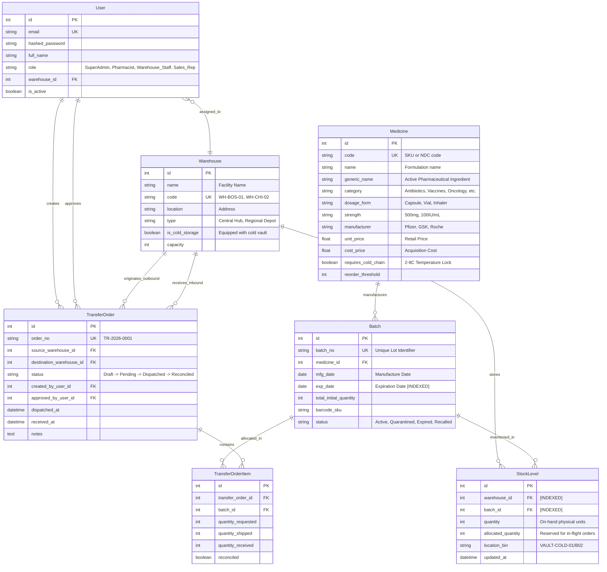

# PharmaTrack ERP & Supply Chain Distribution Platform

[](#architecture-overview)
[](#compliance--regulatory-validation)
[](#)

An enterprise-grade **Pharmacy ERP & Supply Chain Distribution Platform** engineered for pharmaceutical logistics providers, hospital systems, and multi-depot dispensary networks. The platform guarantees strict batch tracking, automated First-Expired, First-Out (FEFO) dispensing, governed multi-warehouse transfers, and fine-grained Role-Based Access Control (RBAC).

---

## Architecture Overview

```
                      +---------------------------------------+
                      |      ReactJS + Tailwind CSS UI       |
                      |     (Vite, TypeScript, Lucide)        |
                      +-------------------+-------------------+
                                          |
                                HTTP / REST API (Port 3000 / Proxy)
                                          |
                      +-------------------v-------------------+
                      |         FastAPI REST Backend          |
                      |    (Python 3.11, Pydantic, PyJWT)     |
                      +-------------------+-------------------+
                                          |
                      +-------------------v-------------------+
                      |       SQLAlchemy ORM + Indexes        |
                      |      (PostgreSQL 16 / SQLite)         |
                      +-------------------+-------------------+
                                          |
     +-----------------+------------------+-----------------+-----------------+
     |                 |                  |                 |                 |
+----v----+       +----v----+        +----v----+       +----v----+       +----v----+
| Medicine|       |  Batch  |        |StockLvl |       |Warehouse|       | Transfer|
| Catalog |       | Tracking|        |  (Bins) |       | Network |       |  Order  |
+---------+       +---------+        +---------+       +---------+       +---------+
```

### Key Technical Capabilities
- **FEFO (First-Expired, First-Out) Optimization**: Algorithmic dispensing engine prioritizing earliest expiring drug lots to slash write-offs and prevent expired delivery.
- **Color-Coded Expiry Risk Radar**: Real-time surveillance categorizing inventory into **Critical Red (< 30 days)**, **Warning Amber (< 90 days)**, and **Valid Green (> 90 days)**.
- **Inter-Warehouse Transfer State Machine**: Formally enforced state lifecycle: `Draft` $\rightarrow$ `Pending Approval` $\rightarrow$ `Dispatched` $\rightarrow$ `Received & Reconciled`.
- **Role-Based Access Control (RBAC)**: Cryptographically validated route guards protecting operations across `SuperAdmin`, `Pharmacist`, `Warehouse_Staff`, and `Sales_Rep`.
- **B-Tree Index Tuning**: Composite indexes tuned for constant-time lot selection across millions of stock records.

---

## Entity-Relationship (ER) Diagram



---

## Milestone Implementation Breakdown

### Milestone 1: Relational Schema & 40+ Formulation Seed
- Models: `Medicine`, `Batch`, `Warehouse`, `StockLevel`, `TransferOrder`, `TransferOrderItem`, `User`.
- **42 Realistic Medicines** with diverse therapeutic categories (Antibiotics, Pain Relief, Vaccines & Biologics, Cardiovascular, Diabetes & Insulins, Respiratory, and Oncology).
- Dynamic batch distribution with expiration profiles calibrated for cold-chain compliance and inventory churn.

### Milestone 2: FEFO Recommendation Engine & Expiry Radar
- **FEFO Engine (`/api/inventory/fefo-recommendation`)**:
  1. Filters active batches where `quantity > allocated_quantity` and `exp_date >= current_date`.
  2. Executes ordering strictly by `Batch.exp_date ASC`.
  3. Greedily allocates available quantities across lots.
  4. Generates an itemized pick ticket with location bins and unit costs.
- **Color-Coded Expiry Surveillance**:
  - **Critical Red (< 30 days)**: Imminent spoilage alert requiring priority dispatch.
  - **Warning Amber (30 – 90 days)**: Mid-term shelf life window targeted for rebalancing.
  - **Valid Green (> 90 days)**: Stable inventory.

### Milestone 3: Inter-Warehouse Transfer State Machine
```
   [ Draft ]
       |  (Submit for Review)
       v
   [ Pending Approval ]  ---- (Rejection / Revision) ----> [ Draft ]
       |  (Authorized by Pharmacist: Allocates Source Stock)
       v
   [ Dispatched ]  ---- (Emergency Recall) ----> [ Cancelled ]
       |  (Physical Delivery Verified by Receiving Staff)
       v
   [ Received & Reconciled ]  (Atomic Stock Rebalance & Bin Placement)
```

### Milestone 4: Role-Based Access Control (RBAC)
| Capability | SuperAdmin | Pharmacist | Warehouse_Staff | Sales_Rep |
| :--- | :---: | :---: | :---: | :---: |
| **Expiry Radar & Stock Batches** | Yes | Yes | Yes | Yes |
| **FEFO Dispense & Pick Tickets** | Yes | Yes | Yes | Read-Only |
| **Draft Transfer Creation** | Yes | Yes | Yes | No |
| **Approve & Dispatch Transfers** | Yes | Yes | No | No |
| **Receive & Reconcile Stock** | Yes | No | Yes | No |
| **Executive Financial Analytics** | Yes | Yes | No | No |
| **User & RBAC Security Settings** | Yes | No | No | No |

### Milestone 5: BI Analytics & Database Index Optimization
- **Financial Margins**: Aggregated gross margin and holding value by therapeutic classification.
- **Spoilage Loss Modeling**: 30-day temporal loss projection demonstrating ~72% salvage recovery through automated FEFO allocation.
- **Index Architecture**:
  - `idx_batch_exp_medicine`: `ON batches (exp_date ASC, medicine_id)` eliminates table scans on high-throughput FEFO pick generation.
  - `idx_stock_warehouse_batch`: `ON stock_levels (warehouse_id, batch_id) [UNIQUE]` enables single-pass atomic inventory balance locking.
  - `idx_medicine_category_name`: `ON medicines (category, name)` speeds up formulary classification queries.

---

## Quickstart & Docker Deployment

### Run with Docker Compose
```bash
# Clone the repository
git clone https://github.com/thanhtrung0017/Pharmacy-ERP.git
cd Pharmacy-ERP

# Build and start PostgreSQL + FastAPI + React
docker compose up --build
```
Access the application at `http://localhost:3000`.

### Local Development Setup
```bash
# 1. Install Node dependencies
npm install

# 2. Install Python dependencies
pip install -r requirements.txt

# 3. Seed Database
python3 -m backend.seed_data

# 4. Start Full-Stack Dev Environment
npm run dev
```

---

## Pre-Configured Test Credentials

| Role | Email | Password | Primary Permissions |
| :--- | :--- | :--- | :--- |
| **SuperAdmin** | `admin@pharmatrack.io` | `Password123!` | Unrestricted enterprise administrative access |
| **Pharmacist** | `pharmacist@pharmatrack.io` | `Password123!` | Formulary control, transfer approvals, FEFO dispensing |
| **Warehouse_Staff** | `warehouse@pharmatrack.io` | `Password123!` | Physical dispatching, receiving, reconciliation |
| **Sales_Rep** | `sales@pharmatrack.io` | `Password123!` | Read-only formulary and inventory availability checks |

*Note: You can instantly toggle between personas in the UI via the "Simulate RBAC Role" selector in the top navbar.*

---
*Built with ReactJS, Vite, Tailwind CSS, FastAPI, and SQLAlchemy.*
